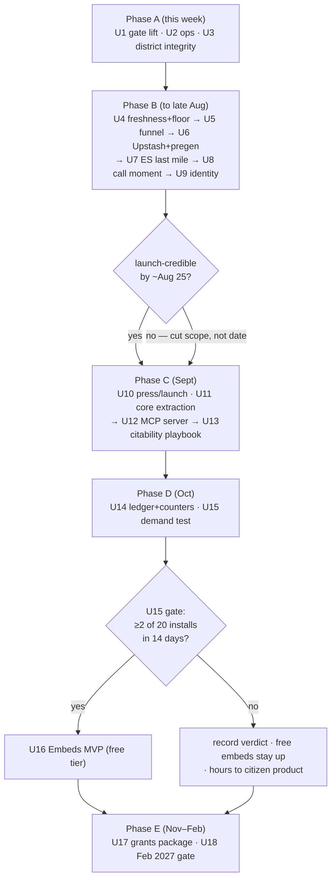
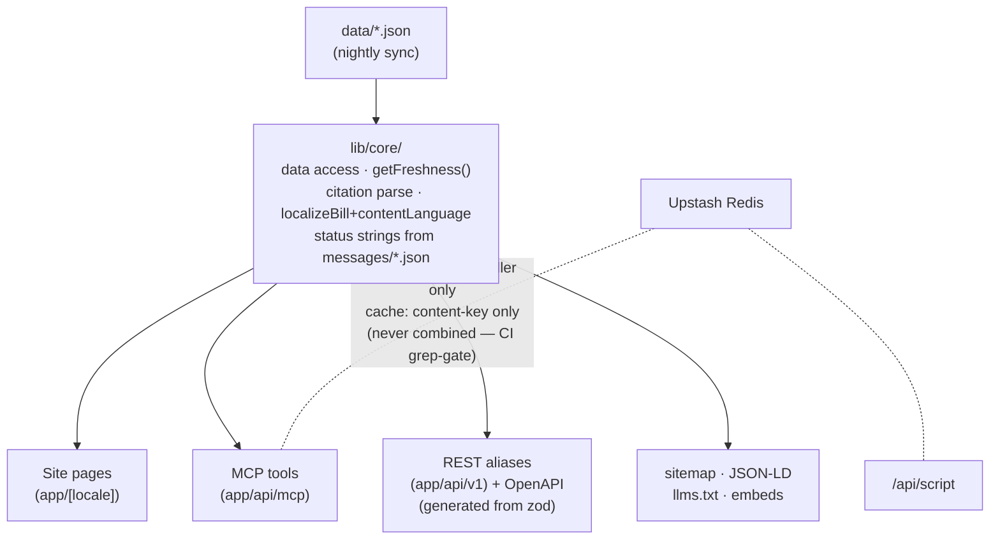
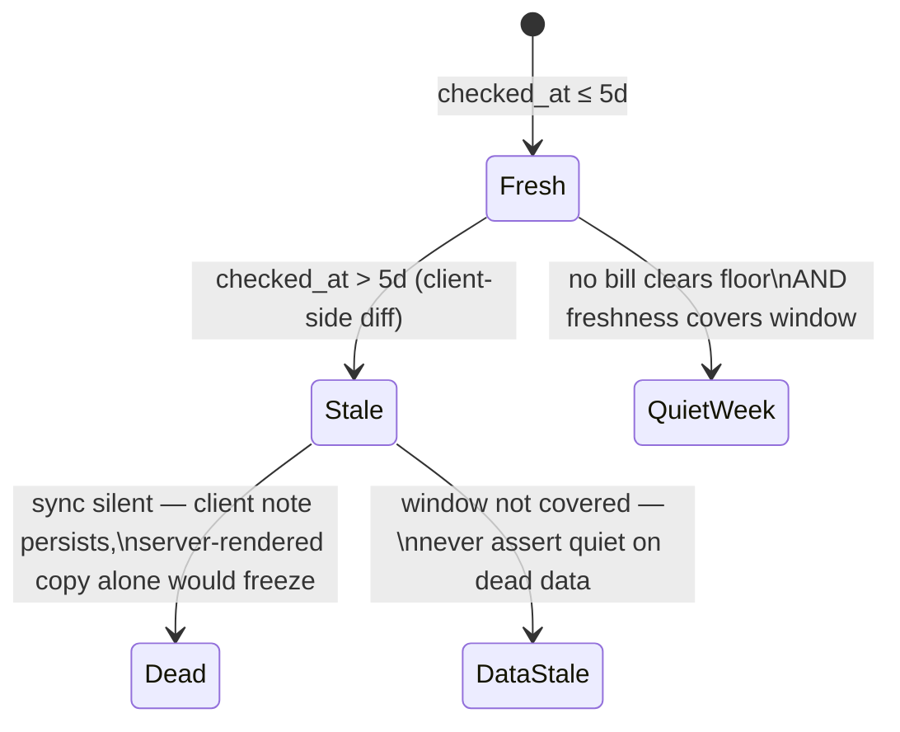

# Rostra Launch & Monetization Buildout - Plan

## Goal Capsule

- **Objective:** Execute the adopted monetization strategy end to end: make the site public this week, reach launch-credible quality by late August for the September 30 government-funding-fight window, ship the free MCP server and citability playbook by early October, run the gated embed demand test in October, and land the grants package after usage data exists — reaching the February 2027 decision gate with every gate verdict recorded.
- **Authority hierarchy:** User (Colby) > this plan > `docs/ideation/2026-07-02-monetization-strategy.md` > companion specs (`docs/ideation/2026-07-02-embeds-spec.md`, `docs/ideation/2026-07-02-mcp-spec.md`) > audit (`docs/ideation/2026-07-01-post-june-audit-ideation.md`). Where research in this plan corrects a spec detail, this plan wins; corrections are named in Key Technical Decisions.
- **Execution profile:** Solo builder at 15–25 hrs/week (~7 PRs/week demonstrated velocity). Phases run sequentially; units within a phase may interleave. Each unit is one PR-sized change. Claude opens PRs; **Colby merges — never Claude** (CLAUDE.md).
- **Stop conditions:** (1) The U15 demand gate fails (<2 of 20 installs in 14 days) → U16 does not start; record the verdict and continue to U17. (2) Claude Connectors Directory rejection → does not block Phase C completion; resubmit per U13's fallback. (3) Any change that would store a caller identifier alongside a content identifier, add accounts to the citizen side, or ship lean labels off-site → stop and surface; these are constitutional. (4) Genuine scope change or contradiction with the strategy → surface to Colby, don't guess.
- **Tail ownership:** Colby merges PRs, sends the demand-test emails, signs grant applications, and makes the Feb 2027 gate call. Non-code units (U2, U17, U18) produce checklists and drafts for Colby to execute.

---

## Product Contract

### Summary

Rostra is pre-launch behind a deliberate `noindex` gate, with launch-quality gaps its own audit ranked (stale-data copy, buried call funnel, undesigned call moment, Spanish break at the script step) and an adopted strategy that monetizes institutions while keeping the citizen product free and account-free. This plan lifts the gate first, fixes the launch-quality gaps second, then builds the two institutional surfaces (MCP, embeds) behind their decided gates, with grants work after usage data exists. Every workstream inherits the constitution: zero server-side user data on the citizen side, EN/ES parity per change, nonpartisan by construction, AI content labeled and human-reviewed, AA accessibility.

### Problem Frame

Three builds in four months have died polished-but-unlaunched; Rostra's gate was re-affirmed the day before the strategy was adopted. Meanwhile the product's data honesty (bill data ~3 weeks behind under "this week" copy), its highest-stakes flow (the call moment, and its Spanish last mile), and its runtime hardening (in-memory cache and rate limits, per README's own caveat) are below launch bar. The strategy's revenue lines — grants, embeds, MCP citations, earned media — all have "the site is public and credible" as a hard prerequisite, and the earned-media window (the Sept 30 funding fight) is fixed on the calendar.

### Requirements

**Launch and distribution**

- R1. The site is publicly indexable: the robots-noindex gate and its CI warning are removed together, and `sitemap.ts` + `robots.ts` with correct EN/ES hreflang alternates ship in the same change, without disturbing the `rostra-build` meta that nightly deploy verification greps for.
- R2. Every surface tells the truth about data freshness: a corpus-level "data as of" stamp from one shared accessor, a staleness note that still works when the sync is dead, and an absolute urgency floor so "Act now" can be honestly empty (quiet-week state) instead of populated by rank.
- R3. The homepage and `/reps` funnel re-center on the call: the call section leads, news demotes, and `/reps` continues into "worth a call this week" instead of dead-ending at phone numbers.
- R4. The call moment gets its designed slice: a pre-dial beat that survives the app-switch, an office-hours line scoped to the DC number, and the existing copy-script affordance kept and polished.
- R5. A Spanish-locale caller gets a paired script — Spanish to rehearse, short plain English to read aloud, one honest guidance sentence — delivered at the call modal, plus "in English" labels on English-language articles everywhere the ES locale shows them.
- R6. The identity is press-ready at minimal scope: a real Rostra mark replaces the `PhoneCall` icon chip and the "Cabina/phone booth" token documentation is retired. The sync-commit author identity is untouched (deploy-coupling incident).

**Infrastructure and privacy**

- R7. The script cache and rate limits move from per-instance memory to Upstash Redis with the decided privacy design: hashed-IP counters (10-min TTL, daily salt) strictly separated from content-keyed cache, enforced by a CI grep-gate on key construction and a runtime invariant test.
- R8. Spike readiness precedes any press-visible moment: nightly pre-generation of all 6 scripts for top-band bills (warms the shared cache, no data commit), a degraded mode that serves cached scripts, and the migration landing early in Phase B — not last.
- R9. District data is integrity-checked: provenance documented, the Census geocoder layer pinned by explicit vintage, a CI cross-check that every reachable (state, district) resolves to a sitting rep or a designed vacant-seat state, with a dated October re-check against mid-decade redistricting.

**Agent surface and citability**

- R10. A free, keyless, read-only MCP server ships inside the Next app with 5 tools (`lookup_representatives`, `get_bill`, `search_bills`, `whats_moving`, `get_representative`), a citation envelope (`as_of`, `canonical_url`, `cite`, `ai_label`, `content_language`), structured in-band errors, server instructions carrying the nonpartisan framing and privacy posture, and no script generation over MCP.
- R11. The citability playbook lands: official MCP registry entry, PulseMCP/Glama/Smithery claims, Claude Connectors Directory submission (non-blocking), OpenAPI 3.1 REST aliases generated from the tool schemas, `llms.txt`, per-bill JSON-LD with hreflang, and a public citability/corrections page — all reading freshness from the same shared accessor as the site.

**Measurement and institutions**

- R12. Progress is measurable without violating privacy: a client-side "it counted" ledger with a versioned schema, per-request content-only stance counters, and one global call counter (a single number — no bill, no caller) so the 1,000-calls-by-Nov-3 goal is reportable.
- R13. The embed demand test runs in early October with a falsifiable gate: minimal lookup + bill-card iframes, 20 LION-member emails selected by state/beat match, "install" defined as the recipient's domain appearing in Referer-derived daily aggregates, verdict recorded ≥2/20 within 14 days per recipient.
- R14. The embeds MVP (free tier per the embeds spec) is built only if the R13 gate passes.
- R15. The grants package ships after usage data exists: public funding-disclosure page, usage one-pager, applications to the verified open doors, and an HCB-hosted donation page.

**Governance**

- R16. Decided-and-closed items are not re-litigated: no `draft_call_script` over MCP; no lean labels on MCP or embeds (AllSides CC BY-NC); no stance-in-URL deep links; no bill-level call tallies (heartbeat decision); no social features, ads/trackers, advocacy-CRM mechanics, or partisan money; no sync-author rename; MCP stays free/keyless with only the dormant `X-Rostra-Key` hook; embeds build only past the gate.

### Scope Boundaries

**Deferred to follow-up work** (planned, not in this plan's units)

- Embeds v1.1 paid tier (Stripe, white-label, action panel, aggregate impression counts) — its own plan if U15's gate passes and free-tier installs show life.
- Institutional API keys activation (Stripe billing against `X-Rostra-Key`) — Feb 2027 gate decision.
- Pre-generated human-spot-checked scripts as static MCP resources (MCP spec v1.5) — after observing v1 traffic.
- `get_bill_coverage` MCP tool — pending a lean-free one-sidedness-disclaimer strategy or an AllSides commercial license.
- State legislatures via Open States — 2027 option.
- ChatGPT Apps directory submission — after the Claude directory clears.

**Deferred for later** (carried from origin)

- Night-inverted call screen (audit idea 4's largest slice) — stretch only if Phase B runs ahead of schedule.
- Full identity work beyond the minimal mark (lore surfacing, night-surface metaphor).

**Outside this product's identity** (carried from origin; never)

- Social features, profiles, feeds, comments. Ads and analytics trackers. Advocacy-CRM mechanics (advocate capture, stance-shaping) for any customer. Partisan funding (Higher Ground Labs declined by name). Server-side accounts or personalization for citizens. Call logging or preference storage over MCP. Scorecards/grades on representatives. x402/crypto micropayments.

### Acceptance Examples

- AE1. **Split-ZIP over MCP.** Given a ZIP mapping to 2 districts, when an agent calls `lookup_representatives` without an address, then senators return as certain, both House candidates return marked uncertain with `needs_address: true`, and the refine hint contains the never-stored/never-logged sentence verbatim.
- AE2. **ES fallback is labeled.** Given one of the bills without a Spanish decode, when `get_bill(locale: 'es')` is called, then the response carries `content_language: 'en'` and a fallback marker — English text is never presented as the Spanish summary.
- AE3. **Quiet week vs. data outage.** Given fresh data where no bill clears the urgency floor, `whats_moving` returns an empty list with `quiet_week: true`; given a stale corpus (freshness older than the claim window), it returns `data_stale` instead — it never asserts quiet on dead data. The site's empty band renders the same tri-state.
- AE4. **Demand gate arithmetic.** Given 20 sent emails each with a live demo embed, when fewer than 2 recipient domains are confirmed within 14 days of their send date, then U16 does not start and the recorded verdict routes effort per the strategy's failure branches. Referer aggregates only nominate candidate domains — a domain counts only after manual visual confirmation (the embed seen live on the recipient's page), because Referer is client-controlled and the gate triggers a four-week build.
- AE5. **Privacy invariant.** Given any burst of script/MCP requests, when Upstash state is inspected, then no counter key contains a slug/tool/locale substring, no cache key contains IP-derived material, and no key anywhere contains address-derived material. Additionally, no caller-originating request carries a stance or content identifier in a URL path or query string (the district route's POST-not-GET rule, promoted to a tested invariant across `/api/script`, MCP, and embed routes).

---

## Planning Contract

### Assumptions

Adopted after two unanswered calibration rounds; each is revisable and re-cutting the plan is cheap:

- Full-buildout scope (Phase 0 → Feb 2027) with gates encoded, per "full plan for this buildout."
- Noindex lift is the immediate first milestone (the strategy's central verdict).
- Heavy part-time capacity (15–25 hrs/wk). Full-time pulls Phase C ~3 weeks earlier; ≤10 hrs/wk pushes MCP past the fall window and the plan should be re-cut to launch-only.
- Strategy adopted as written; research-driven corrections are confined to the four call-outs recorded in Key Technical Decisions (KTD-2, KTD-4, KTD-6, KTD-8).

### Key Technical Decisions

- KTD-1. **Freshness is three named timestamps from one accessor.** `data/sync-state.json` holds a cursor high-water (`lastSync`, deliberately weeks old during the decode-backlog drain), a last-successful-run time (`lastRun`), and the corpus's newest `last_action_date` — they currently disagree by ~a month. A shared `getFreshness()` in the extracted core returns `{checked_at (lastRun), complete_through (lastSync), newest_action (max last_action_date)}`. The site stamp renders "checked {checked_at} · newest recorded action {newest_action}"; the MCP envelope's `as_of` carries `checked_at` + `complete_through`. No surface reads `sync-state.json` directly. Rationale: rendering any single timestamp either claims false freshness or false staleness (`docs/solutions/pinned-sync-cursor.md`, `bare-date-cursor-400.md`).
- KTD-2. **The urgency floor is a deliberate re-reversal.** `lib/taxonomy.ts` records that absolute floors were removed because they left "Act now" empty most weeks; rank-relative bands were the fix. This plan reinstates an absolute floor — honesty over fullness is the strategy's verdict — implemented in `lib/urgency.mjs`/`lib/taxonomy.ts` with the pinned tests in `tests/urgency.unit.spec.ts` retuned in the same change, the taxonomy comment rewritten to record both reversals, and a designed quiet-week empty state. The staleness note is a client component (server-side rendering of "stale" freezes when the sync dies — the exact silent-failure shape this repo has shipped three times).
- KTD-3. **Upstash privacy design (decided in the MCP spec; hardened here).** Caller-keyed rate counters (`sha256(ip + daily_salt)` → count, TTL ≤ 10 min) and content-keyed cache (`slug:stance:locale`) live in **two separate Upstash databases**, not just two namespaces — a single database's command log would temporally re-pair caller and content that the key design separates. Salt requirements: ≥128-bit CSPRNG output (never date-derived — a 32-bit IP space brute-forces in seconds against a weak salt); stored in the counter database with atomic create and 24h TTL (the at-rest exposure window is accepted, in writing, here); a loud-failure salt-age verifier ships in the same unit (KTD-10) so silent rotation failure can't turn daily pseudonyms into stable identifiers. Vocabulary rule: these are "short-lived rate-limit counters," never "anonymized" — hashing a small space is pseudonymization and the privacy posture says so. Enforcement is structural: a CI grep-gate on the key-construction helpers (the single registry of every namespace), a runtime invariant test, and a request-shape invariant (AE5). Raw IPs are currently used unhashed in `app/api/script/route.ts` (compliant only because in-memory) — hashing is new work, not a refactor. Accepted residual, disclosed publicly (U13 about-data, U12 privacy resource): platform request logs see IP + page/embed path — interest-level exposure, never stance.
- KTD-4. **Measurement counters are content-only or count-only — and best-effort, spoofable by design.** Stance mix: increment `stance:{support|oppose|undecided}` on every `/api/script` request (cache hits included; nightly pre-generation excluded via an authenticated path, never a public flag — KTD/U6) — counting cache-key *creations* would measure corpus breadth, not demand, and pre-generation would poison exactly the hot bills. Call count: a global counter incremented on outcome logging, **daily-bucketed** (`calls:total:{date}`) so anomalous spike days can be identified and excluded from reported figures without any caller dimension. These are unauthenticated public writes; every mitigation stronger than hashed-IP rate limiting would reintroduce caller tracking, so the counters are accepted as indicative — U17's one-pager discloses the measurement basis and U18 reads the bucketed series, not raw totals. Bill-level tallies stay dead: even caller-free per-slug counts re-open the heartbeat decision (R16).
- KTD-5. **Pure data core before agent surfaces.** `lib/core/` extracts the data access, `getFreshness()`, citation parsing (extending `lib/format.ts`), and `localizeBill` returning `{bill, contentLanguage}` — no `server-only`, no next-intl imports; status plain-language strings imported from `messages/*.json` so bilingual parity CI covers the MCP surface. The split is not all of `lib/data.ts`: coverage-dependent code (`getNewsBills`, which imports `lib/coverage` → `data/media-bias.json`) stays in the server-only shell — moving it would self-conflict with the import gate — and `lib/urgency.mjs` is **re-exported through core, not relocated** (sync scripts import it by path; relocating churns pipeline files in a refactor PR). Band/floor logic is reachable via core so `whats_moving` never imports past the boundary. Site, MCP, REST aliases, sitemap, JSON-LD, and embeds all consume the core; an ESLint `no-restricted-imports` rule prevents core → server-only imports (the rule ships with U4, when the directory is born), and an import-level CI gate bans `lib/coverage` and `data/media-bias.json` from MCP and embed routes (license + guardrail containment).
- KTD-6. **MCP v1 is 5 tools; the coverage tool is cut.** Lean-stripping `get_bill_coverage` also strips the one-sidedness disclaimer that is computed *from* lean data — an agent could relay three same-lean headlines as "the coverage" under Rostra's name. Cut beats crippled; revisit per Scope Boundaries. `whats_moving` drops its `days` param (bands are rank/floor-based, not day-windowed) and distinguishes `quiet_week` from `data_stale` (KTD-1). Structured in-band errors with hints (`invalid_zip` vs `unknown_zip`, `unknown_slug` + suggestions, `geocoder_unavailable` → degrade with `resolved: false`); every tool returns `structuredContent` + text + declared `outputSchema`; the envelope adds a pre-formatted `cite` string. OpenAPI is generated from the zod tool schemas, never hand-authored.
- KTD-7. **Sequencing is load-bearing.** Freshness stamp + urgency floor are the first Phase B PR (the site is indexable from Phase A — "this week" copy over month-old data is the trust-killing screenshot; "indexable ≠ announced" is the accepted residual). Upstash migration + pre-generation land before any press-visible moment (a spike onto per-instance caches means duplicate Sonnet spend, 10s waits at the emotional peak, and rate limits multiplied by instance count).
- KTD-8. **Demand test mechanics corrected from the strategy.** Recipient selection is LION members matched by state/beat to a live bill (the strategy's "covered a bill in `data/coverage.json`" criterion is unsatisfiable — its 69 slugs contain zero LION-class outlets). The demo ships both minimal embeds (lookup + bill card — both static). "Install" = recipient domain observed in Referer-derived daily aggregates (host-domain counting is institutional data, allowed; no cookies/beacons). Emails send early October; a miss counts as a miss (the retry-at-next-flashpoint branch is already in the embeds spec).
- KTD-9. **Web surface conventions.** New pages/routes ship via the app router (`app/sitemap.ts`, `app/robots.ts`, an `llms.txt` route) rather than `public/` — the `public/` allowlist gate is deliberately empty; any true static asset (the Rostra mark) is allowlisted in the same PR. A single `SITE_URL`/`metadataBase` constant (new `lib/site.ts`) feeds sitemap, hreflang, JSON-LD, OpenAPI servers, and the MCP envelope; nothing hardcodes the domain. hreflang encodes the `as-needed` locale-prefix asymmetry (EN unprefixed, ES under `/es`), x-default = EN.
- KTD-10. **Pipeline conventions inherited by anything new.** Any new committing workflow copies the exact author-identity + rebase-retry + SHA-verify block from `.github/workflows/sync-bills.yml`, joins the `data-sync` concurrency group, and keeps its file set disjoint (the rebase-retry safety proof). Every pipeline-adjacent unit ships its own loud-failure verifier in the same unit (the repo's proven countermeasure to its documented silent-failure disease). Nightly pre-generation warms Upstash only — no data commit, so no new committing workflow in this plan.

### High-Level Technical Design

Phase sequencing with gates:

One data spine, four surfaces (drift guard = the shared core):

Freshness/staleness tri-state (KTD-1, KTD-2 — rendered on site stamp, quiet-week band, and MCP envelope):

### System-Wide Impact

- **One core, five consumers.** `lib/core/` (U11) feeds site pages, MCP (U12), REST aliases + OpenAPI (U13), sitemap/JSON-LD/llms.txt (U1/U13), and embeds (U15/U16). `lib/data.ts` remains the server-only shell holding what core must not contain (coverage-dependent code, presentation helpers).
- **Seam ordering.** U4 births `lib/core/freshness.ts` before U11 fills the package — coherent because the import boundary (ESLint rule) ships with U4: the directory is born with its rule; U11 adds contents.
- **CI-gate interactions.** Static gates (parity, allowlist, key-namespace grep, import gates, district integrity, OpenAPI regen) run before the Playwright build; only e2e needs the app. District integrity also runs in the nightly sync workflow after the data commit. OpenAPI byte-equality requires deterministic generation (sorted keys, no timestamps). Agent evals (Anthropic-calling) run on tool-schema/description change, not per-PR.
- **Deploy couplings.** `verify-deploy` regexes the `rostra-build` meta on the prod homepage and silently skips when `PROD_URL` is unset (U2 confirms it). Vercel Pro (U2) precedes U6. Preview deployment protection, if enabled, blocks U1's curl checks, U6's staged burst, and U12's real-client MCP test (U2 records the posture). Preview and prod must not share Upstash keyspace (U6).
- **Sync-death propagation.** Dead sync → no data commits → no deploys → the whole SSG surface freezes. The client `StalenessNote` is the only honest surface then; MCP/REST return `data_stale`; press-page numbers (U10) and embed cards (U15/U16) carry the same client staleness treatment — a frozen "act now" card on a third-party page is KTD-7's trust-killing screenshot, exported.
- **Parity blast radius.** `messages/*.json` now feeds site + MCP envelope strings + embeds. The parity gate checks EN↔ES key sets only; a key rename passes parity yet fails silently on raw-JSON consumers — U12/U15/U16 carry a key-resolution test.
- **Upstash lifecycle.** Rate counters self-expire (≤10 min). Script-cache entries get TTL ≤ 24h or a `last_action_date` fingerprint in the key — a persisted script must not outlive its bill's status (the in-memory cache died on redeploy by accident; Upstash removes that accident). `stance:*` and `calls:total:{date}` are deliberately durable. The key-helper module is the single registry of every namespace, including U15's Referer aggregates.

---

## Implementation Units

Unit Index (phases run in order; units within a phase in listed order unless noted):

| U-ID | Title | Phase | Key files | Depends on |
|---|---|---|---|---|
| U1 | Lift the launch gate + sitemap/robots/hreflang | A | `app/[locale]/layout.tsx`, `app/sitemap.ts`, `app/robots.ts`, `lib/site.ts`, `.github/workflows/ci.yml` | — |
| U2 | Launch ops checklist (non-code) | A | — | — |
| U3 | District-data integrity | A | `lib/district.ts`, `scripts/check-district-integrity.mjs`, `docs/data-provenance.md` | — |
| U4 | Freshness truth + honest urgency floor | B | `lib/core/freshness.ts`, `lib/urgency.mjs`, `lib/taxonomy.ts`, `lib/data.ts`, `components/` | U1 |
| U5 | Funnel re-centering | B | `app/[locale]/page.tsx`, `app/[locale]/reps/page.tsx` | — |
| U6 | Upstash migration + spike readiness + counters | B | `app/api/script/route.ts`, `lib/ratelimit.ts`, `scripts/pregenerate-scripts.mjs`, `scripts/check-key-namespaces.mjs` | — |
| U7 | Spanish last mile | B | `app/api/script/route.ts`, `components/ActionPanel.tsx`, `components/CoverageSection.tsx`, `components/NewsLens.tsx` | U6 |
| U8 | Call-moment slice | B | `components/ActionPanel.tsx` | U7 |
| U9 | Identity finish (minimal) | B | `components/Header.tsx`, `DESIGN.md`, `public/` | — |
| U10 | Press kit + launch execution | C | `app/[locale]/press/page.tsx` | U4–U9 |
| U11 | Pure data core extraction | C | `lib/core/*`, `lib/data.ts`, `eslint.config.*` | U4 |
| U12 | MCP server (5 tools) | C | `app/api/mcp/[transport]/route.ts`, `lib/mcp/*` | U6, U11 |
| U13 | Citability playbook | C | `app/api/v1/*`, `app/llms.txt/route.ts`, `app/[locale]/about-data/page.tsx`, bill-page JSON-LD | U1, U2, U11, U12 |
| U14 | "It counted" ledger + call counter | D | `lib/local.ts`, `components/`, `app/[locale]/impact/page.tsx` | U6 |
| U15 | Embed demand test | D | `app/embed/*`, outreach kit | U6, U11 |
| U16 | Embeds MVP free tier (GATED) | E | per embeds spec | U15 gate ≥2/20 |
| U17 | Grants package | E | `app/[locale]/funding/page.tsx` (or footer section), application drafts | U2, U10, U14 |
| U18 | Feb 2027 decision gate review | E | — | U13, U15, U17 |

**Phase A — pattern-breaker (target: within 7 days)**

### U1. Lift the launch gate + sitemap/robots/hreflang

- **Goal:** The site is indexable, mapped, and hreflang-correct in one PR; the CI warning dies with the gate.
- **Requirements:** R1
- **Dependencies:** none — this is deliberately first.
- **Files:** `app/[locale]/layout.tsx` (remove the robots block at ~lines 28–32 only), `.github/workflows/ci.yml` (remove the "Launch-gate reminder" step, ~lines 13–19), new `lib/site.ts` (SITE_URL/metadataBase constant, env-overridable), new `app/sitemap.ts`, new `app/robots.ts`, tests `tests/sitemap.spec.ts`.
- **Approach:** Sitemap enumerates via `getAllBills()`/`billSlug` (mirror `generateStaticParams` in `app/[locale]/bills/[id]/page.tsx`) plus the static pages, with `alternates.languages` encoding the `as-needed` asymmetry (EN unprefixed, ES `/es/...`, x-default EN). Set `metadataBase` from `lib/site.ts`. **Do not disturb** the `rostra-build` meta emission (`app/[locale]/layout.tsx` ~lines 33–36) — `scripts/verify-deploy.mjs` regex-matches it nightly.
- **Patterns to follow:** URL enumeration in `app/[locale]/bills/[id]/page.tsx:16-20`; metadata conventions in the existing `generateMetadata` exports; `app/` routes not `public/` (KTD-9).
- **Test scenarios:** sitemap contains every bill slug × both locales with correct prefix asymmetry and hreflang pairs; robots output allows indexing and points at the sitemap; rendered layout metadata contains no `robots.index: false`; the `rostra-build` meta is still emitted (pin with the same regex `verify-deploy.mjs` uses); `ci.yml` no longer greps for the gate.
- **Verification:** CI green (parity, allowlist, e2e); `curl` of `/sitemap.xml` and `/robots.txt` on the preview deploy; verify-deploy passes on the next nightly.

### U2. Launch ops checklist (non-code)

- **Goal:** The commercial/organizational rails exist before anything monetizes or solicits.
- **Requirements:** R1 (supporting), R15 (prerequisite)
- **Dependencies:** none; parallel-safe.
- **Files:** none (checklist deliverable in the PR description or `docs/ideation/` note).
- **Approach:** Colby executes: upgrade Vercel to Pro (Hobby prohibits commercial use); confirm the `PROD_URL` repo variable is set (verify-deploy silently skips without it); confirm rostra.org ownership, DNS control, and production alias (gates U13 registry verification and the future embed subdomain — this is the plan's one blocking-adjacent unknown, see Open Questions); record the Vercel preview deployment-protection posture (it gates U1's preview curl checks, U6's staged burst, and U12's real-client MCP testing); start the HCB fiscal-sponsorship application (~7% fee, unlocks c3 grants and tax-deductible donations); make one dated public launch commitment (external witness — the pattern-breaker the strategy prescribes).
- **Test scenarios:** Test expectation: none — operational checklist; each item has a yes/no completion state recorded in the PR/checklist.
- **Verification:** All five items checked, or blockers surfaced by date +7 days.

### U3. District-data integrity

- **Goal:** ZIP→district→rep lookups can't silently drop a House member during redistricting or a vacancy — the failure mode becomes loud or designed.
- **Requirements:** R9
- **Dependencies:** none.
- **Files:** new `docs/data-provenance.md`, `lib/district.ts` (+ its Census fixture tests), new `scripts/check-district-integrity.mjs`, `.github/workflows/ci.yml` (wire the check), `components/RepCard.tsx` or the reps page (vacant-seat note), `messages/en.json` + `messages/es.json`.
- **Approach:** Provenance doc transcribes the sources already named in `scripts/process-data.py` (unitedstates/congress-legislators; OpenSourceActivismTech `zccd.csv`) plus the semantic pin: *lookups answer current representation — 119th boundaries until the 120th seats*. Pin the Census geocoder request to an explicit vintage (`layers=` param) instead of pattern-matching any vintage in `lib/district.ts`. The integrity check asserts every (state, district) in `data/zip-districts.json` — and every district the geocoder can return — resolves to exactly one sitting House member, failing loudly on orphans; genuine vacancies render a designed "seat vacant / in transition" note instead of silently showing senators only. Add the dated October TX-redistricting re-check to the checklist.
- **Execution note:** Extend the existing captured-fixture test style (`tests/fixtures/census-*.json`) rather than hitting the live geocoder in CI.
- **Test scenarios:** integrity script passes on current data and fails on a synthetic orphaned district; a synthetic vacancy renders the vacant-seat note in both locales; `lib/district.ts` rejects/flags a response from a non-pinned vintage (fixture with a renumbered TX district).
- **Verification:** New CI job green; provenance doc reviewed; vacancy state visible in a Playwright screenshot.

**Phase B — launch quality (target: launch-credible by ~Aug 25). U4 is the first PR; U6 lands before any press-visible moment (KTD-7).**

### U4. Freshness truth + honest urgency floor

- **Goal:** No surface claims freshness or urgency the data doesn't have — the audit's #2 idea, now also load-bearing for MCP citability.
- **Requirements:** R2
- **Dependencies:** U1 (site is public; this is the first quality PR after it).
- **Files:** new `lib/core/freshness.ts` (the `getFreshness()` accessor — seeds U11's core) plus the ESLint `no-restricted-imports` boundary rule for `lib/core/**` (the directory is born with its rule; U11 adds contents), `lib/urgency.mjs`, `lib/taxonomy.ts`, `lib/data.ts` (`getTeasers`, `getTopActions`), `components/BillsBrowser.tsx`, new `components/FreshnessStamp.tsx` + client `components/StalenessNote.tsx`, `app/[locale]/page.tsx` (quiet-week empty state), footer component, `tests/urgency.unit.spec.ts` (retune pins), new `tests/freshness.spec.ts`, `messages/en.json` + `messages/es.json`.
- **Approach:** KTD-1's three-timestamp accessor; stamp renders "checked {checked_at} · newest action {newest_action}" in footer + bills header. Staleness note is a client component diffing `checked_at` vs now (tri-state: fresh / >5d / sync-dead), so a dead sync can't freeze a false "fresh" (KTD-2). Absolute floor + quiet-week: implement in/next to `lib/urgency.mjs` and `bandForEff`/`bandFloors` in `lib/taxonomy.ts`; `getTopActions` respects the floor; empty "Act now" renders the designed quiet-week state (never padded). Rewrite the taxonomy comment to record both reversals. `whats_moving` (U12) must import this same module — a third copy is the drift the `stale-urgency-freeze` incident closed.
- **Execution note:** Retune the pinned exact-value tests deliberately in the same change — a floor change without touching `tests/urgency.unit.spec.ts` means the floor isn't actually wired.
- **Test scenarios:** floor boundary (score at/below floor → quiet week; above → populated); tri-state note at fresh/6-days/sync-dead (mock clock); stamp values all come from `getFreshness()` (no direct `sync-state.json` import elsewhere — grep test); signed-law bills never render under early-stage bands (audit item); parity keys for stamp/note/quiet-week in both locales.
- **Verification:** Playwright screenshots of quiet-week and stale states; `tests/urgency.unit.spec.ts` green with new pins.

### U5. Funnel re-centering

- **Goal:** The 5-second homepage read is "make a call that counts," and `/reps` continues into the product instead of dead-ending.
- **Requirements:** R3
- **Dependencies:** none (can precede U4).
- **Files:** `app/[locale]/page.tsx` (move the "Top actions" block above `NewsLens`), `app/[locale]/reps/page.tsx` (append a "worth a call this week" block), `messages/*.json` (section intro strings), extend the existing home/reps Playwright specs.
- **Approach:** Block moves reusing existing components — homepage already renders `getTopActions(4)` + `BillCard` + `formatCitation` (lines ~50–82); `/reps` already imports `lib/data.ts`. Keep the `news.length > 0` guard; news demotes below the call grid.
- **Test scenarios:** homepage section order asserts call-grid before news; `/reps` with a valid ZIP renders the continuation block with ≥1 action linking to a bill page; empty-actions quiet-week scenario lands with U4 if U5 merges first (soft dependency — the only U4-coupled scenario); parity for new strings.
- **Verification:** e2e green; before/after screenshots in the PR.

### U6. Upstash migration + spike readiness + counters

- **Goal:** The known-broken in-memory layer is replaced with the decided privacy design, the cache is pre-warmed where spikes concentrate, and the measurement counters exist — before any press moment.
- **Requirements:** R7, R8, R12 (counters), R16
- **Dependencies:** none hard; sequenced early in Phase B (KTD-7).
- **Files:** `app/api/script/route.ts`, new `lib/ratelimit.ts` + `lib/scriptcache.ts` (key-construction helpers — the grep-gate surface), new `scripts/pregenerate-scripts.mjs` + a nightly workflow step (warms KV — no data commit, so no new committing workflow), new `scripts/check-key-namespaces.mjs` wired into `ci.yml`, new `tests/upstash-privacy.spec.ts`, `CLAUDE.md` + `README.md` (amend the "ANTHROPIC_API_KEY is the only runtime secret" line — Upstash credentials join it).
- **Approach:** KTD-3 verbatim: hashed-IP counters (CSPRNG daily salt with 24h TTL + a loud salt-age verifier, ≤10-min counter TTL, count only) and `slug:stance:locale` content cache in **two separate Upstash databases**; helpers are the only place keys are built. Cache entries carry TTL ≤ 24h or a `last_action_date` fingerprint in the key (a persisted script must not outlive its bill's status — the in-memory cache died on redeploy by accident). Preview and prod use separate keyspaces (U6's own staged burst must not pollute prod counters). Stance counters per KTD-4. Pre-generation: all 6 scripts for top-band bills nightly, inside a `MAX_PREGEN` cost cap mirroring `MAX_NEW_DECODES`, resumable oldest-first (learning #5) — authenticated with a build-time secret or writing the cache directly via Upstash credentials, never a public request flag: an unauthenticated request presenting any pregen marker is rejected loudly and is counted and rate-limited normally. Degraded mode: on Anthropic failure serve the cached script, never queue. Keep per-IP limits at current values; global backstop via Vercel WAF noted in ops.
- **Execution note:** The privacy invariant is the point — write `tests/upstash-privacy.spec.ts` first (assert no counter key contains slug/tool/locale substrings; no cache key contains IP-derived material; no key contains address-derived material) and make the CI grep-gate fail on any key construction outside the helpers.
- **Test scenarios:** AE5 runtime invariant after a burst, including the request-shape check (no stance/content identifier in any caller-originating URL); limiter: 9th request in 10 min → 429 with retry-after; cache: two requests same (slug,stance,locale) → one generation (mock Anthropic); spoofed pregen marker without the secret → normal counting + normal limits; salt-age verifier alarms on a >24h salt; degraded mode serves cache on mocked API failure; grep-gate fails on a planted violation.
- **Verification:** CI green incl. the new gate; a staged burst against a preview deploy shows shared limits across instances; CLAUDE.md/README amended in the same PR.

### U7. Spanish last mile

- **Goal:** The ES flow stops breaking at its highest-stakes step: the caller rehearses in Spanish, reads in short plain English, and knows what to expect when the line answers.
- **Requirements:** R5
- **Dependencies:** U6 (cache schema — the dual payload must land before key shapes freeze).
- **Files:** `app/api/script/route.ts` (ES prompt at ~lines 68–71 becomes a dual-output structured payload under the existing `slug:stance:es` key — one generation, KTD/flow I1), `components/ActionPanel.tsx` (call-modal toggle: ES-rehearsal / EN-read-aloud, guidance sentence rendered at the modal, clipboard copies EN read-aloud with ES beneath), `components/CoverageSection.tsx` + `components/NewsLens.tsx` ("in English" label + `lang="en"` on English article links in the ES locale — both surfaces), `messages/en.json` + `messages/es.json`, new `tests/es-script.spec.ts`.
- **Approach:** Single generation per key keeps rate/cost budgets intact (no new nightly spend; learning #5). Guidance copy: office answers in English; leaving the voicemail in Spanish is legitimate — say your ZIP so it's counted. Per-stance draft state holds the structured pair.
- **Test scenarios:** es-locale e2e: stance → script shows both parts labeled → call modal toggle works → clipboard content is the EN read-aloud; EN fallback case (bill without ES decode) is labeled, never silent; ES homepage NewsLens and bill-page coverage both show the "in English" chip; parity gate covers every new key; cache: one Anthropic call produces both parts.
- **Verification:** e2e green in both locales; manual review of one generated pair for tone (the ES-reviewer hire from the strategy is not yet assumed — spot-check by Colby).

### U8. Call-moment slice

- **Goal:** The 60 seconds around the dial stop being the least-designed screen: the app-switch is survivable, expectations are set, and the affordances that exist get polished.
- **Requirements:** R4
- **Dependencies:** U7 (modal work stacks on the ES toggle).
- **Files:** `components/ActionPanel.tsx` (call-mode modal: pre-dial beat, state preserved across app-switch/return, DC office-hours line), `messages/*.json`, extend `tests/call-action.spec.ts`.
- **Approach:** Pre-dial beat: one screen before `tel:` — what happens next, script visible, modal state survives backgrounding (client state, no storage changes). Office-hours line: client-side clock against the DC office's hours only (flow I8 — district offices span timezones; scoping to DC is the honest cheap option), phrased as reassurance ("you'll almost certainly get voicemail — the gentlest first call"). Copy-to-clipboard already exists (`copyScript`) — keep, polish placement. Voicemail-parity copy stays adjacent to the dial action. Night-inverted screen remains out of scope (Scope Boundaries).
- **Test scenarios:** modal survives visibilitychange/blur-return with draft intact; hours line renders voicemail-likely outside DC business hours and omits/adjusts inside them (mock clock); `tel:` links present for DC + district offices with 44px targets; reduced-motion respected; parity.
- **Verification:** e2e green; manual phone-in-hand walkthrough on a real device (the flow's whole point).

### U9. Identity finish (minimal)

- **Goal:** Press coverage has a real mark and no phone-booth residue — nothing more.
- **Requirements:** R6, R16 (sync-author untouched)
- **Dependencies:** none; any time in Phase B.
- **Files:** `components/Header.tsx` (replace the `PhoneCall` lucide chip, ~lines 3, 29), favicon/OG assets (`app/[locale]/opengraph-image.tsx`, icon files), `public/` allowlist additions in `scripts/check-public-allowlist.mjs`'s list, `DESIGN.md` (retire the "Cabina era" token framing, ~line 16 — keep the `booth` token name, document it as legacy).
- **Approach:** A simple stepped-platform mark (the Rostra lore) as inline SVG component — no external font/asset dependencies. Leave `lib/local.ts`'s `cabina.*→rostra.*` migration code untouched (it's a data migration, not branding). **Non-goal:** renaming the `rostra-sync` commit author — the owner-linked identity is what makes Vercel deploy at all (`docs/solutions/vercel-bot-push-blocked-deploys.md`).
- **Test scenarios:** Test expectation: minimal — allowlist gate passes with new assets; visual smoke of header/favicon/OG in both locales; no `PhoneCall` import remains in `Header.tsx`.
- **Verification:** CI green; OG image renders the new mark.

**Phase C — the moment (September). U11 → U12 → U13 in strict order; U10 executes around them.**

### U10. Press kit + launch execution

- **Goal:** The launch lands into the funding-fight window with numbers, story, and a place to point journalists.
- **Requirements:** R2–R6 complete (credibility), R15 (seeds)
- **Dependencies:** U4–U9 (U9 supplies the downloadable mark).
- **Files:** new `app/[locale]/press/page.tsx` (fact sheet: what Rostra is, the numbers, the privacy/bilingual/nonpartisan hooks, contact, downloadable mark), `messages/*.json` (parity applies — the audience is English-first but the rule is constitutional), outreach drafts as a checklist deliverable.
- **Approach:** Pre-written pitches per the 5 Calls playbook (concrete counts, solo-builder story, "free replacement for the APIs Google and ProPublica turned off" infrastructure angle, ES-gap angle for Spanish-language press). Send during the funding fight, not before. Launch ≠ index (that happened in U1); launch = announcement + pitches.
- **Test scenarios:** press page renders in both locales with AA contrast; fact-sheet numbers are sourced from `getFreshness()`/live data at build, phrased "as of {checked_at}" and carrying the client `StalenessNote` (a dead sync must not freeze false-fresh press numbers); allowlist for downloadable assets.
- **Verification:** Page live; pitch checklist executed by Colby during the window; outcomes recorded.

### U11. Pure data core extraction

- **Goal:** One boring module serves site, MCP, REST, metadata, and embeds — drift becomes structurally hard.
- **Requirements:** R10, R11 (prerequisite)
- **Dependencies:** U4 (freshness accessor seeds the core).
- **Files:** new `lib/core/` (move data access from `lib/data.ts`, `freshness.ts` from U4, citation parsing extended from `lib/format.ts`, `localizeBill` returning `{bill, contentLanguage}`, status strings imported from `messages/*.json`), `lib/data.ts` becomes a thin server-only re-export, ESLint `no-restricted-imports` rule (core must not import `server-only`/next-intl), new import-gate check (MCP/embed routes must never import `lib/coverage` or `data/media-bias.json`) wired into CI.
- **Approach:** KTD-5. Behavior-preserving refactor: pages consume the same functions via the re-export; the only new behavior is `contentLanguage` (site ignores it; U12/U15 surface it).
- **Execution note:** Characterization first — pin current `getTeasers`/`getTopActions`/`localizeBill` outputs for a fixed dataset before moving code, so the refactor proves itself no-op.
- **Test scenarios:** characterization pins pass unchanged post-move; ES fallback returns `contentLanguage: 'en'` + flag for a bill without ES decode; import-gate fails on a planted `lib/coverage` import in an MCP route stub; ESLint rule fails on a planted `server-only` import in core.
- **Verification:** Full e2e suite green (site behavior unchanged); new gates green.

### U12. MCP server (5 tools)

- **Goal:** The canonical civic MCP server, free and keyless, correct for agents by construction.
- **Requirements:** R10, R16
- **Dependencies:** U6 (shared limits), U11 (core).
- **Files:** new `app/api/mcp/[transport]/route.ts` (Vercel `mcp-handler`, Streamable HTTP, stateless), new `lib/mcp/` (zod schemas per tool, envelope builder, error taxonomy, server instructions, 3 resources: `how_to_act`, `data_provenance`, `privacy_posture`), extend `scripts/check-key-namespaces.mjs` scope to the MCP route, new `tests/mcp.spec.ts`, new agent-eval fixtures (mirroring the repo's coverage A/B eval-harness culture).
- **Approach:** KTD-6. Tools: `lookup_representatives` (structured split-ZIP shape: senators certain, House candidates with `certain: boolean`, `needs_address`, `refine_hint` carrying the never-stored sentence verbatim; addresses reuse the `/api/district` stateless proxy path), `get_bill` (loose citation acceptance via the core parser; `act_url` locale-aware), `search_bills`, `whats_moving` (no `days` param; floor/quiet-week/data-stale tri-state from U4's module), `get_representative` (facts only). Envelope: `as_of` (checked_at + complete_through), `canonical_url`, `cite` (pre-formatted attribution string), `ai_label` (iff AI content), `content_language`. `structuredContent` + text + `outputSchema`; `readOnlyHint: true`, `openWorldHint: false` on all. Server `instructions` carry the nonpartisan framing, privacy posture, citation rule, and the provenance rule ("if you compose a phone script yourself, present it as your own — Rostra's human-reviewed scripts exist only at act_url"). Address log hygiene, promoted from comment-convention to enforced gate: error paths never serialize tool arguments; the grep-gate and invariant test also ban address-derived material in any key and any logging statement in the district/MCP-lookup path; the `refine_hint`/`privacy_posture` never-stored sentence gains the transit disclosure ("your address is sent once to the U.S. Census geocoder from our server and discarded; Rostra never stores or logs it"). Rate limits per U6; platform-egress question has a measured default (Open Questions). Envelope/refine-hint user-relayable strings go through `messages/*.json` (parity covers the agent surface), with a key-resolution test since raw-JSON consumers fail silently on renames.
- **Execution note:** Test-first on the deterministic matrix below; run the agent-shaped evals before directory submission and after any description/schema edit.
- **Test scenarios:** AE1 split-ZIP (with and without address, Census fixtures); geocoder-outage degrade (`resolved: false`, not an error); AE2 ES round-trip + fallback labeling; AE3 quiet-week vs data-stale; envelope: `as_of === getFreshness()` values, every `canonical_url`/`act_url` for every slug resolves, `cite` format pinned, `ai_label` iff AI content; error matrix (`1234`→invalid_zip; `00000`→unknown_zip+hint; `hr-99999-119`→unknown_slug+suggestions; "HR 1234"/"h.r. 1234"/"hr-1234-119" all resolve identically; `locale:'fr'` coerces to en); rate-limit returns in-band `rate_limited` + retry_after, then AE5 key inspection; geocoder failure during an MCP lookup produces `geocoder_unavailable` with zero log output containing the request URL or args; site/MCP parity for N random bills (fields equal page-rendered values; `whats_moving` equals the site's bands); annotations audit (every tool read-only); agent-shaped: ~10-prompt tool-selection fixture set (incl. "¿qué hace H.R. 1234?" → `locale:'es'`; "write me a call script" → agent offers `act_url`, no Rostra-script claim) and the split-ZIP dialogue eval (asks for address AND relays the never-stored promise).
- **Verification:** All deterministic tests in CI; eval transcripts reviewed; server exercised end-to-end from Claude Desktop/Code as a real client.

### U13. Citability playbook

- **Goal:** Rostra is findable, citable, and listed everywhere agents look — with directory approval explicitly non-blocking.
- **Requirements:** R11
- **Dependencies:** U11, U12.
- **Files:** registry `server.json` (via `mcp-publisher`, rostra.org namespace verification), new `app/api/v1/` REST aliases (same handlers; OpenAPI 3.1 generated from the zod schemas — never hand-authored), new `app/llms.txt/route.ts` (<2KB: what Rostra is, URL patterns, MCP endpoint, as_of semantics, license, corrections URL), per-bill JSON-LD (`schema.org/Legislation` incl. `legislationStatus`, `inLanguage`) in `app/[locale]/bills/[id]/page.tsx` + hreflang (from U1), new `app/[locale]/about-data/page.tsx` (citability: stable-slug promise/301s, "data as of" semantics, correction policy with dated corrections, methodology notes, and the accepted-residual disclosure from KTD-3 — platform request logs see IP + page path, interest-level, never stance), PulseMCP/Glama/Smithery claims, Claude Connectors Directory submission.
- **Approach:** Sequence: registry + REST + llms.txt + JSON-LD + citability page stand alone; directory review is a non-blocking tail (pre-written resubmission framing: "read-only nonpartisan civic data," no message generation; budget one review round-trip). **Decision task in this unit:** the AI-summary license (envelope `license` field + llms.txt) — default CC BY 4.0 with attribution; ES redistribution spot-check (a native-speaker pass over a sample of ES decodes) is part of this unit's done, per the strategy's review-bar flag.
- **Test scenarios:** JSON-LD validates (schema.org tooling) for a sample of bills in both locales; OpenAPI spec regenerates byte-identical from schemas in CI (drift gate); `/llms.txt` serves <2KB with the decided license string; REST alias responses carry the same envelope/freshness as MCP (flow I7 — cache lifetimes bounded below sync cadence); about-data page parity + AA.
- **Verification:** Registry entry live under the verified namespace; listings claimed; directory submission filed with outcome tracked; Rich-results/validator screenshots in the PR.

**Phase D — measurement + the gate (October, before the post-election collapse)**

### U14. "It counted" ledger + call counter

- **Goal:** Return visits close the loop ("H.R. 1234, which you called about, passed the House"), and the 1,000-calls goal is reportable without a single caller identifier.
- **Requirements:** R12, R16
- **Dependencies:** U6 (counter namespaces).
- **Files:** `lib/local.ts` (snapshot bill status + `last_action_date` at call time; versioned schema field from day one), new diff-on-return logic + "since your visit" strip component, `app/[locale]/impact/page.tsx` (narrative ledger reframe), `app/api/script/route.ts` or outcome-log path (increment `calls:total:{date}` — count only, daily-bucketed per KTD-4), `messages/*.json`, new `tests/ledger.spec.ts`.
- **Approach:** KTD-4: the global counter is one number — no slug, no locale beyond an aggregate, no caller anything; bill-level tallies are a named non-goal (heartbeat). Ledger handles terminal/renamed/aged-out slugs gracefully (flow M2) — a called-about bill that disappears renders a designed "this Congress ended/bill archived" state, never a crash or silent drop. Outcome phrasing stays nonpartisan (status facts, not wins/losses).
- **Test scenarios:** call → snapshot stored with schema version; return after status change → strip renders the diff; missing/terminal slug → archived state; localStorage erase-all still clears everything; counter increments on outcome log and contains no other dimensions (extend AE5 inspection); parity.
- **Verification:** e2e green; manual two-visit walkthrough; counter visible in Upstash console as a bare integer.

### U15. Embed demand test

- **Goal:** Twenty falsifiable emails settle whether the paid embed thesis deserves four build-weeks.
- **Requirements:** R13, R16
- **Dependencies:** U6 (aggregate keys live in the counter store), U11 (core); sends early October (KTD-8).
- **Files:** new `app/embed/` route group (chrome-less lookup + bill-card iframes, path-based for the test — the subdomain arrives with U16), a plain snippet/instructions page, Referer-domain daily aggregate counting (registrable domain → count only, truncated at ingestion; institutional data, allowed; no cookies/beacons/storage), site-wide frame posture (`frame-ancestors 'self'` on all site routes with the sole carve-out for `app/embed/*`, which is frameable by any host with a minimal embed CSP), outreach kit (20 LION members matched by state/beat, per-recipient send dates), new `tests/embed-privacy.spec.ts`.
- **Approach:** KTD-8 mechanics. The embeds are static renders over the core; EN/ES toggle present; AI-label on bill cards (constitutional at every tier); bill cards carry the freshness stamp/staleness tri-state (a frozen "act now" card on a third-party page is the trust-killing screenshot, exported). **ZIP-only: the street-address refinement flow is excluded from iframes** — address entry on an arbitrary third-party page is an overlay-phishing surface the site context doesn't have; the embed links out for split-ZIP refinement. Frame hardening ships here, not U16, so the permissive posture can't become permanent on the gate-fail branch. Privacy gates from day one: zero cookies, zero third-party requests, zero storage — the Playwright gate follows `tests/call-action.spec.ts`'s data-driven style and asserts via `page.context().cookies()` + request interception. Gate evaluation at each recipient's day 14 per AE4: Referer aggregates nominate candidate domains; each counted domain requires manual visual confirmation (the embed seen live on the recipient's page) — Referer is client-controlled and the gate triggers a four-week build. Verdict recorded in the plan's decision log (PR description + `docs/ideation/` note).
- **Test scenarios:** privacy triple-zero on both embeds; iframe renders a real bill and a real ZIP lookup; Referer aggregation stores registrable domain + count only, with a full-URL-Referer fixture proving truncation happens at ingestion (path/query never persisted); frame-posture headers: a bill page returns `frame-ancestors 'self'`, the embed route returns the permissive carve-out; no address-refinement UI reachable inside an iframe; miss-path renders nothing broken for a recipient who never installs (no dangling tenant states — there are none).
- **Verification:** Embeds live on preview + prod; 20 emails sent by Colby with send dates logged; day-14 verdict recorded → gates U16.

**Phase E — gated build + harvest (November → February)**

### U16. Embeds MVP free tier (GATED on U15 ≥2/20)

- **Goal:** The Datawrapper-loop free tier per the embeds spec — only now that demand is evidenced.
- **Requirements:** R14, R16
- **Dependencies:** U15 gate pass. If the gate fails: this unit does not start; free test embeds stay up at ~$0 carrying cost.
- **Files:** per `docs/ideation/2026-07-02-embeds-spec.md` §6 W1–W4 (embed.rostra.org subdomain, `loader.js` + postMessage auto-resize, portrait mirroring into the deploy, configurator + snippet generator + gallery + docs, `/privacy` + `privacy.json`, versioned loader URLs, full privacy CI).
- **Approach:** The spec is the authority for this unit; this plan adds only: attribution links point at canonical pages (U1's sitemap makes them count); `content_language` surfaces on ES cards (from U11); the import-gate (no `lib/coverage`/media-bias) extends to embed routes. Paid tier remains deferred (Scope Boundaries).
- **Test scenarios:** the spec's privacy CI set (zero cookies/third-party/storage on every widget, loader does nothing but inject/resize); auto-resize on content change; EN/ES parity; a11y AA inside the iframe; allowlist/import gates.
- **Verification:** Spec §6 W4's launch kit ready; kill-criteria clock starts (<10 active domains or <$300 MRR-equivalent by 2027-01-31 freezes paid plans).

### U17. Grants package

- **Goal:** Applications go out with a usage number, a spike story, and clean funding optics.
- **Requirements:** R15
- **Dependencies:** U10 (launch happened), U14 (the number exists); HCB from U2 approved.
- **Files:** funding-disclosure section/page (`app/[locale]/funding/page.tsx` or a privacy-page section — implementer's call), HCB donation page setup, application drafts (Press Forward local chapters via the fiscal sponsor; Latino Community Foundation; Trust for Civic Life with the rural/border bilingual frame; Echoing Green if the window opens; Mozilla Builders only if a cohort is announced), usage one-pager sourced from live counters.
- **Approach:** Grants accelerate features, never fund recurring costs (strategy rule). Disclosure page lists every funder — the mitigation for left-adjacent coding risk. Partisan money declined by name stays declined (R16).
- **Test scenarios:** Test expectation: minimal — disclosure page parity + AA; one-pager numbers pull from real counters, not hardcoded.
- **Verification:** Applications submitted by Colby with dates logged; disclosure page live before the first dollar.

### U18. Feb 2027 decision gate review

- **Goal:** The strategy's gate fires as an explicit, recorded decision, not a drift.
- **Requirements:** R16 (governance)
- **Dependencies:** U13, U15, U17 outcomes.
- **Files:** a dated decision memo in `docs/ideation/`.
- **Approach:** Review against the strategy's criteria: MCP call volume + directory-referred traffic, embed installs/MRR vs. kill criteria, grant pipeline, the 1,000-calls result, stance-mix evidence on nonpartisan demand. Outcomes: double down / freeze (everything frozen survives at ~$0 carrying cost) / activate institutional keys. The memo records the verdict and the next plan.
- **Test scenarios:** Test expectation: none — decision checkpoint.
- **Verification:** Memo exists, dated, with a decision per workstream.

---

## Verification Contract

| Gate | Command | Applies to |
|---|---|---|
| Lint | `npm run lint` | all units |
| E2E + unit (builds app on :3300) | `npx playwright test` | all code units |
| EN/ES parity | `node scripts/check-messages-parity.mjs` | every unit adding strings (U1, U3–U10, U13–U16) |
| public/ allowlist | `node scripts/check-public-allowlist.mjs` | U9, U10, U16 |
| Key-namespace privacy grep-gate | `node scripts/check-key-namespaces.mjs` (new, U6) | U6, U12, U14, U15 (Referer aggregates) |
| Core import gates | ESLint rule (U4) + import-gate check (U11) | U4, U11, U12, U15, U16 |
| Message-key resolution | raw-JSON consumer key check (new, U12) | U12, U15, U16 (parity alone doesn't catch renames) |
| District integrity | `node scripts/check-district-integrity.mjs` (new, U3) | U3, nightly |
| Pipeline dead-man's-switch | `node scripts/verify-sync.mjs` / `scripts/verify-deploy.mjs` | untouched; U1 must keep verify-deploy green |
| OpenAPI drift | regeneration byte-equality in CI (new, U13; generation must be deterministic — sorted keys, no timestamps) | U13 |
| Agent-shaped evals | MCP eval fixture run (new, U12) | on tool-description/schema change, not per-PR (cost/flakiness) |

Quality bar carried from the repo: every pipeline-adjacent unit ships its own loud-failure verifier in the same unit; incident-class fixes end with a `docs/solutions/` entry.

---

## Definition of Done

**Global:**

- Site public and indexable with sitemap/hreflang; `verify-deploy` green on the nightly after U1.
- Launch executed into the September window; press page live; outcomes recorded.
- MCP live, listed in the official registry + at least two secondary registries; directory submission filed (approval explicitly not required for done).
- Demand test executed with a recorded verdict; U16 built only on a pass.
- All new CI gates green and enforced in `ci.yml`; EN/ES parity holds at every merge; no caller-identifier ever co-occurs with a content identifier in any store (AE5 class).
- CLAUDE.md/README amended where the plan changes their claims (runtime secrets in U6; API surface in U12/U13).
- The three unanswered calibration forks (revenue goal, advocacy posture already resolved structurally, launch commitment) surfaced to Colby at least once more before U18.
- No abandoned experimental code: dead ends from any unit are removed before its PR merges.

**Per-unit:** each unit's Verification section, plus: U1 within 7 days of plan acceptance; U4 is Phase B's first merged PR; U6 merged before U10 executes; U15 verdict recorded by each recipient's day 14.

---

## Risks & Dependencies

- **Directory/political-content review misreads the server as advocacy** — mitigation: framing rules in U12's instructions; approval non-blocking (U13); resubmission pre-written.
- **rostra.org assumption fails** (not owned/aliased) — U2 confirms in week 1; registry namespace, hreflang absolutes, and the embed subdomain all depend on it; fallback is the Vercel production domain with the registry entry deferred.
- **Mid-decade redistricting (TX et al.)** shifts Census layers or `zccd.csv` mid-cycle — U3's vintage pin + integrity CI turns silent wrongness into loud failure; dated October re-check.
- **Congress.gov API outage** degrades freshness, never availability (baked JSON); the stamp makes it honest — no new mitigation needed beyond KTD-1.
- **Platform egress rate-limiting** (one hashed IP = a whole assistant platform) — measured default in Open Questions; never solved with a per-user identifier.
- **Anthropic spend spike** — bounded by cache + pre-generation + rate limits (U6) and `draft_call_script`'s MCP exclusion; hard ceiling remains the prepaid balance.
- **ES text redistributed by agents/embeds below the site's review bar** — U13's spot-check; the contract ES-reviewer remains the sanctioned hire if volume warrants.
- **Solo capacity** — phases are strictly sequential; the plan's honest failure mode is cutting Phase C scope (directory tail, REST aliases) rather than slipping U1/U4/U6.

## Open Questions

- **Deferred (defaults set):** AI-summary license — default CC BY 4.0 w/ attribution; decided inside U13. Platform-egress limits — default: measure real Claude-client egress in U12's first week, then set verified-platform multipliers. Demand-test miss during post-election collapse — default: a miss counts (KTD-8); Colby may override before sends.
- **Blocking only for U13's registry item:** rostra.org ownership/DNS/alias confirmation (U2, week 1).

## Sources & Research

Origin: `docs/ideation/2026-07-02-monetization-strategy.md` (+ embeds/MCP specs, audit doc). Plan-time research: repo-pattern pass (file/line anchors used throughout the units), institutional-learnings pass over `docs/solutions/` + workflow comments (KTD-7, KTD-10, the sync-author and cursor constraints), flow/edge-case analysis (KTD-1, KTD-2 tri-state, KTD-8 corrections, U3's vacancy state), and an agent-native review (U12's tool shapes, envelope `cite`/`content_language`, the coverage-tool cut in KTD-6, U12's eval scenarios). External market research was inherited from the origin (independently verified there; 0 of 24 claims refuted) and shaped KTD-6, KTD-8, and Phase E's gates.
